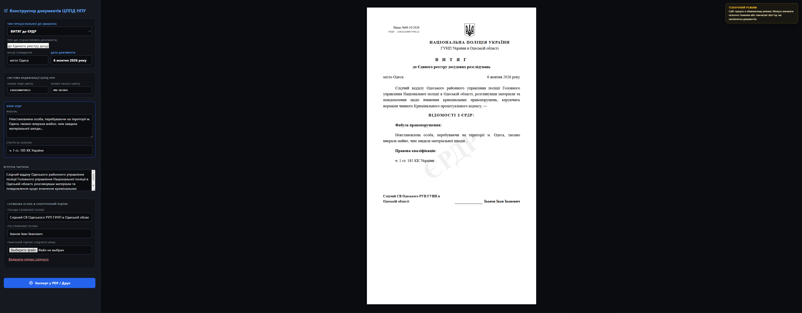

# CPPD NPU

## Web-Center for the Preparation of Procedural Documents

<div align="center">
  
</div>

A lightweight procedural document generator prototype built for a roleplay-oriented front-end workflow. The project focuses on a structured document form, document preview, and static UI logic without a backend or production authentication layer.

---

## Overview

**CPPD (Center for the Preparation of Procedural Documents)** is a static frontend concept for procedural document generation in a police/official-document context. It is designed as a compact single-page system with templated document outputs, controlled form states, and a final print/export flow.

This repository is provided for portfolio review and reference.

## Key features

- Document template flow
- Structured procedural form fields
- Dynamic content switching by document type
- Preview-oriented document layout
- Local static deployment
- Print/export friendly presentation

## Stack

- HTML5
- CSS3
- JavaScript (ES6+)
- Web Crypto API
- Static frontend architecture
- No production backend / no real auth system

## Project structure

```text
CPPD-NPU/
├── assets/
│   └── demo.png
├── gerb.gif
├── index.html
├── styles.css
├── script.js
├── .gitignore
├── LICENSE
└── README.md
```

---

## Licensing status

This project is published under the PolyForm Noncommercial License 1.0.0 — see [LICENSE](LICENSE) for full terms and Required Notice.

- Permitted: viewing, personal and noncommercial use, and use by noncommercial organizations as defined by the license.
- Prohibited: commercial use, sublicensing, or redistribution for commercial purposes without a separate commercial license from the author.

To request a commercial or proprietary license, contact the author.

---

<div align="center">

Developed and maintained by **xeraze**

</div>